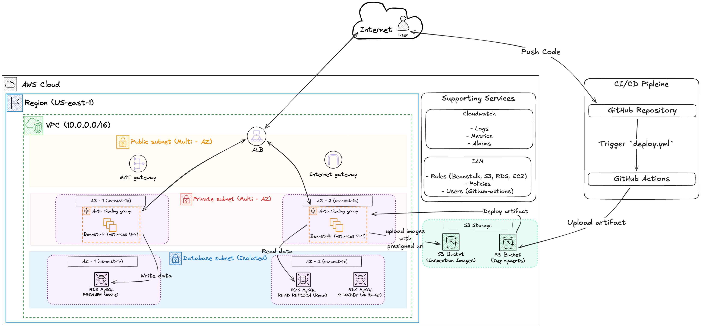

# 🏗️ 3-Tier Inspection Platform with AWS Elastic Beanstalk

A production-ready, cloud-native building inspection platform built on AWS using a 3-tier microservices architecture. This project demonstrates enterprise-grade deployment patterns including Blue/Green deployments, CI/CD automation, high availability, and infrastructure as code.


---

## 📋 Table of Contents

- [Overview](#-overview)
- [Architecture](#-architecture)
- [Features](#-features)
- [Tech Stack](#-tech-stack)
- [Project Structure](#-project-structure)
- [Prerequisites](#-prerequisites)
- [Quick Start](#-quick-start)
- [Infrastructure Setup](#-infrastructure-setup)
- [Service Details](#-service-details)
- [Database Schema](#-database-schema)
- [CI/CD Pipeline](#-cicd-pipeline)
- [Deployment](#-deployment)
- [Environment Variables](#-environment-variables)
- [API Reference](#-api-reference)
- [Security](#-security)
- [Monitoring & Logging](#-monitoring--logging)
- [Cost Optimization](#-cost-optimization)
- [Troubleshooting](#-troubleshooting)

---

## Overview

A simple building inspection platform where:

- Inspectors fill in a form to inspect a buidling for the client
- Inspectors attach an image of the property condition
- Client understands the value of the property based on the checks
- Inspectors and Clients get a full report generated for the property they can share

---

## Architecture



### Architecture Highlights

| Component             | Purpose                            | High Availability                |
| --------------------- | ---------------------------------- | -------------------------------- |
| **Shared ALB**        | Path-based routing to all services | Multi-AZ, Single entry point     |
| **Elastic Beanstalk** | Application hosting & management   | Auto Scaling (1-4 instances)     |
| **RDS MySQL**         | Relational data storage            | Multi-AZ + Read Replica          |
| **S3**                | Image/document storage             | Cross-region replication capable |
| **VPC**               | Network isolation                  | 2 AZs, 6 subnets                 |

### Shared ALB Routing

All three microservices share a single Application Load Balancer with path-based routing:

| Path Pattern         | Target Service | Priority | Description                             |
| -------------------- | -------------- | -------- | --------------------------------------- |
| `/api/inspections/*` | Inspection API | 100      | CRUD operations for inspections         |
| `/api/presigned-url` | Inspection API | 100      | S3 presigned URL generation             |
| `/api/reports/*`     | Report Service | 110      | Report generation and retrieval         |
| `/*`                 | Frontend       | 999      | React SPA and static assets (catch-all) |

**Benefits of Shared ALB:**

- 💰 **Cost Savings**: Single ALB instead of three separate ones
- 🔧 **Simplified Architecture**: One entry point for all services
- 🚀 **Better Performance**: Direct routing at ALB level (no proxy hop)
- 📊 **Unified Monitoring**: All traffic metrics in one place

---

## ✨ Features

### Application Features

- 📋 **Inspection Management**: Create, update, and track property inspections
- ✅ **Comprehensive Checklists**: Rate Roof, Foundation, Plumbing, Electrical, HVAC
- 📷 **Image Uploads**: Secure direct-to-S3 uploads via presigned URLs
- 📊 **Report Generation**: Auto-generated inspection reports with condition scoring
- 🔍 **Status Tracking**: Draft → Submitted → Report Generated workflow

### Infrastructure Features

- 🔄 **Blue/Green Deployments**: Zero-downtime deployments via Immutable policy
- 🏗️ **Infrastructure as Code**: Complete Terraform automation
- 📈 **Auto Scaling**: Handle variable traffic loads (1-4 instances per service)
- 🔒 **Security**: Multi-layer security groups, private subnets, encrypted storage
- 📊 **Enhanced Monitoring**: CloudWatch integration for logs and metrics
- 🔧 **CI/CD**: GitHub Actions workflow for automated deployments

---

## 🛠️ Tech Stack

### Frontend

| Technology   | Version | Purpose           |
| ------------ | ------- | ----------------- |
| React        | 18.x    | UI Framework      |
| Vite         | 6.x     | Build Tool        |
| Tailwind CSS | 3.x     | Styling           |
| Express.js   | 4.x     | Production Server |

### Backend Services

| Technology | Version | Purpose         |
| ---------- | ------- | --------------- |
| Node.js    | 20.x    | Runtime         |
| Express.js | 5.x     | Web Framework   |
| MySQL2     | 3.x     | Database Client |
| AWS SDK v3 | 3.x     | S3 Integration  |

### Infrastructure

| Technology                | Version | Purpose                |
| ------------------------- | ------- | ---------------------- |
| AWS Elastic Beanstalk     | -       | Application Platform   |
| Amazon RDS (MySQL)        | 8.0     | Database               |
| Amazon S3                 | -       | Object Storage         |
| Amazon VPC                | -       | Network Isolation      |
| Application Load Balancer | -       | Traffic Distribution   |
| Terraform                 | 1.x     | Infrastructure as Code |

### CI/CD

| Technology     | Purpose               |
| -------------- | --------------------- |
| GitHub Actions | CI/CD Pipeline        |
| AWS CLI        | Deployment Automation |

---

## 📋 Prerequisites

Before you begin, ensure you have:

### Required Tools

- **AWS CLI** v2.x - [Installation Guide](https://docs.aws.amazon.com/cli/latest/userguide/install-cliv2.html)
- **Terraform** v1.0+ - [Installation Guide](https://learn.hashicorp.com/tutorials/terraform/install-cli)
- **Node.js** v20.x - [Installation Guide](https://nodejs.org/)
- **Git** - [Installation Guide](https://git-scm.com/downloads)

### AWS Resources

- AWS Account with appropriate permissions
- IAM user/role with permissions for:
  - EC2, VPC, RDS, S3, Elastic Beanstalk
  - IAM (for role creation)
  - CloudWatch (for monitoring)

### Verify Installation

```bash
# Check AWS CLI
aws --version
# aws-cli/2.x.x ...

# Check Terraform
terraform --version
# Terraform v1.x.x

# Check Node.js
node --version
# v20.x.x

# Check npm
npm --version
# 10.x.x
```

---

## 🚀 Quick Start

### 1. Clone the Repository

```bash
git clone https://github.com/your-repo/inspection-platform-beanstalk-microservice.git
cd inspection-platform-beanstalk-microservice
```

### 2. Configure AWS Credentials

```bash
aws configure
# Enter your AWS Access Key ID
# Enter your AWS Secret Access Key
# Default region: us-east-1
# Default output format: json
```

### 3. Set Up Terraform Variables

```bash
cd terraform
cp terraform.tfvars.example terraform.tfvars

# Edit terraform.tfvars with your values
vim terraform.tfvars
```

**terraform.tfvars example:**

```hcl
aws_region       = "us-east-1"
environment      = "dev"
db_username      = "admin"
db_password      = "YourSecurePassword123!"
db_name          = "inspection_platform"
enable_multi_az  = true
```

### 4. Deploy Infrastructure

```bash
# Initialize Terraform
terraform init

# Preview changes
terraform plan

# Apply infrastructure
terraform apply
```

### 5. Initialize Database

```bash
# Connect to RDS and run schema
mysql -h <rds-endpoint> -u admin -p < ../schema.sql
```

### 6. Deploy Applications

```bash
# Navigate to services and deploy each service
# See Deployment section for detailed instructions
```

---

## 🏗️ Infrastructure Setup

### Terraform Resources Created

| Resource         | Count | Description                       |
| ---------------- | ----- | --------------------------------- |
| VPC              | 1     | 10.0.0.0/16 CIDR                  |
| Public Subnets   | 2     | For ALB, NAT Gateway              |
| Private Subnets  | 2     | For EC2 instances                 |
| Database Subnets | 2     | For RDS (isolated)                |
| NAT Gateway      | 1     | Outbound connectivity             |
| Internet Gateway | 1     | Inbound connectivity              |
| Shared ALB       | 1     | Path-based routing (all services) |
| EB Environments  | 3     | Frontend, API, Report             |
| RDS Primary      | 1     | Multi-AZ MySQL                    |
| RDS Replica      | 1     | Read Replica                      |
| S3 Buckets       | 2     | Images, Deployments               |
| Security Groups  | 5     | ALB, Frontend, APIs, RDS          |

### Network Architecture

```
VPC: 10.0.0.0/16
├── Public Subnets
│   ├── 10.0.1.0/24 (AZ-a) - Shared ALB, NAT
│   └── 10.0.2.0/24 (AZ-b) - Shared ALB
├── Private Subnets
│   ├── 10.0.11.0/24 (AZ-a) - EC2 (All EB Environments)
│   └── 10.0.12.0/24 (AZ-b) - EC2 (All EB Environments)
└── Database Subnets
    ├── 10.0.21.0/24 (AZ-a) - RDS
    └── 10.0.22.0/24 (AZ-b) - RDS
```

---

## 🔧 Service Details

### Frontend Service (Port 8080)

The frontend is a React SPA served by a lightweight Express.js server. API routing is handled directly by the shared ALB, not the frontend.

**Key Features:**

- Vite-built React application
- Static file serving from `/dist`
- SPA fallback routing (all non-file requests → index.html)
- Health check endpoint at `/health`

**Note:** With the shared ALB architecture, the frontend no longer requires proxy middleware. All `/api/*` requests are routed directly to backend services by the ALB before reaching the frontend.

### Inspection API (Port 3001)

Core CRUD service for inspection management.

**Endpoints:**
| Method | Path | Description |
|--------|------|-------------|
| GET | `/health` | Health check |
| POST | `/api/inspections` | Create inspection |
| GET | `/api/inspections` | List all inspections |
| GET | `/api/inspections/:id` | Get single inspection |
| PUT | `/api/inspections/:id` | Update inspection |
| POST | `/api/inspections/:id/images` | Register image |
| GET | `/api/presigned-url` | Get S3 upload URL |

### Report Service (Port 3002)

Handles report generation and retrieval.

**Endpoints:**
| Method | Path | Description |
|--------|------|-------------|
| GET | `/health` | Health check |
| POST | `/api/reports/:inspectionId` | Generate report |
| GET | `/api/reports/:inspectionId` | Get report |
| GET | `/api/reports` | List all reports |

---

## 🗃️ Database Schema

```sql
-- Inspections Table
CREATE TABLE inspections (
    inspection_id VARCHAR(20) PRIMARY KEY,
    property_address VARCHAR(500) NOT NULL,
    inspector_name VARCHAR(255) NOT NULL,
    inspector_email VARCHAR(255) NOT NULL,
    client_name VARCHAR(255) DEFAULT '',
    client_email VARCHAR(255) DEFAULT '',
    status ENUM('DRAFT', 'SUBMITTED', 'REPORT_GENERATED'),

    -- Checklist (Good/Fair/Poor)
    checklist_roof ENUM('Good', 'Fair', 'Poor'),
    checklist_foundation ENUM('Good', 'Fair', 'Poor'),
    checklist_plumbing ENUM('Good', 'Fair', 'Poor'),
    checklist_electrical ENUM('Good', 'Fair', 'Poor'),
    checklist_hvac ENUM('Good', 'Fair', 'Poor'),

    notes TEXT,
    report_generated_at TIMESTAMP NULL,
    created_at TIMESTAMP DEFAULT CURRENT_TIMESTAMP,
    updated_at TIMESTAMP ON UPDATE CURRENT_TIMESTAMP
);

-- Images Table
CREATE TABLE inspection_images (
    image_id VARCHAR(20) PRIMARY KEY,
    inspection_id VARCHAR(20) NOT NULL,
    s3_key VARCHAR(500) NOT NULL,
    file_name VARCHAR(255) NOT NULL,
    FOREIGN KEY (inspection_id) REFERENCES inspections(inspection_id)
);
```

---

## 🔄 CI/CD Pipeline

The GitHub Actions pipeline automates testing, building, and deployment.

### Pipeline Stages

```
┌─────────┐    ┌─────────┐    ┌──────────┐
│  TEST   │───▶│  BUILD  │───▶│  DEPLOY  │
│         │    │         │    │          │
│ • Lint  │    │ • npm   │    │ • S3     │
│ • Test  │    │ • Vite  │    │ • EB     │
│ • Build │    │ • Zip   │    │ • Config │
└─────────┘    └─────────┘    └──────────┘
```

### Triggers

- **Push to `main`**: Full deployment
- **Pull Request**: Test only

### Secrets Required

```yaml
AWS_ACCESS_KEY_ID: Your AWS access key
AWS_SECRET_ACCESS_KEY: Your AWS secret key
```

---

## 🚢 Deployment

### Automated Deployment

Through a push to the repository using GitHub Actions and AWS Beanstalk Environments

### Manual Deployment

```bash
# Deploy Frontend
cd services/frontend
npm ci && npm run build
zip -r frontend.zip dist/ server.js package.json Procfile .ebextensions/
aws s3 cp frontend.zip s3://your-bucket/frontend/
aws elasticbeanstalk create-application-version --application-name inspection-platform --version-label v1.0.0 --source-bundle S3Bucket=your-bucket,S3Key=frontend/frontend.zip
aws elasticbeanstalk update-environment --environment-name inspection-frontend-dev --version-label v1.0.0

# Similar for other services...
```

### Deployment Strategies

| Strategy        | Description                      | Use Case             |
| --------------- | -------------------------------- | -------------------- |
| **Immutable**   | New instances, swap when healthy | Production (default) |
| **Rolling**     | Batch updates                    | Development          |
| **All at Once** | Fastest, no HA                   | Testing              |

---

## 🔐 Environment Variables

### Frontend

| Variable   | Description              |
| ---------- | ------------------------ |
| `PORT`     | Server port (8080)       |
| `NODE_ENV` | Environment (production) |

### Inspection API

| Variable            | Description          |
| ------------------- | -------------------- |
| `PORT`              | Server port (3001)   |
| `DB_HOST`           | RDS endpoint         |
| `DB_USER`           | Database username    |
| `DB_PASSWORD`       | Database password    |
| `DB_NAME`           | Database name        |
| `IMAGE_BUCKET_NAME` | S3 bucket for images |

### Report Service

| Variable       | Description          |
| -------------- | -------------------- |
| `PORT`         | Server port (3002)   |
| `DB_HOST`      | RDS primary endpoint |
| `DB_READ_HOST` | RDS replica endpoint |
| `DB_USER`      | Database username    |
| `DB_PASSWORD`  | Database password    |
| `DB_NAME`      | Database name        |

---

## 📚 API Reference

### Create Inspection

```bash
POST /api/inspections
Content-Type: application/json

{
  "propertyAddress": "123 Main St, City, ST 12345",
  "inspectorName": "John Doe",
  "inspectorEmail": "john@example.com",
  "clientName": "Jane Smith",
  "clientEmail": "jane@example.com"
}
```

### Update Checklist

```bash
PUT /api/inspections/:id
Content-Type: application/json

{
  "checklist": {
    "roof": "Good",
    "foundation": "Fair",
    "plumbing": "Good",
    "electrical": "Good",
    "hvac": "Poor"
  },
  "notes": "HVAC needs immediate attention"
}
```

### Generate Report

```bash
POST /api/reports/:inspectionId
```

---

## 🔒 Security

### Network Security

- **Public Subnets**: Only ALB exposed to internet
- **Private Subnets**: EC2 instances with NAT for outbound
- **Database Subnets**: No internet access

### Security Groups

```
Internet → ALB (80/443)
ALB → Frontend (8080)
ALB → APIs (3001, 3002)
Frontend → APIs (internal proxy)
APIs → RDS (3306)
```

### Data Security

- S3: AES-256 encryption at rest
- S3: Versioning enabled
- S3: Public access blocked
- RDS: Encrypted connections
- Secrets: Environment variables (use AWS Secrets Manager for production)

---

## 📊 Monitoring & Logging

### CloudWatch Integration

- **Logs**: Application logs streamed to CloudWatch
- **Metrics**: CPU, Memory, Request counts
- **Alarms**: Configurable thresholds

### Health Checks

- `/health` endpoint on all services
- ALB health checks every 30 seconds
- Auto-healing via EB

---

## 💰 Cost Optimization

### Free Tier Eligible

- t3.micro instances (750 hours/month)
- db.t3.micro RDS (750 hours/month)
- S3 (5GB storage)
- CloudWatch (basic metrics)

### Cost-Heavy Features (Disable for Dev)

- Multi-AZ RDS: ~$25/month
- NAT Gateway: ~$32/month
- Read Replica: ~$12/month

```hcl
# In terraform.tfvars
enable_multi_az = false  # Disable for free tier
```

---

## 🔧 Troubleshooting

### Common Issues

**EB Environment "Degraded"**

```bash
# Check logs
aws elasticbeanstalk describe-events --environment-name inspection-api-dev
```

**Database Connection Failed**

```bash
# Verify security group allows connection from EB instances
# Check RDS endpoint in environment variables
```

**S3 Upload Failed**

```bash
# Check IAM role has S3 permissions
# Verify bucket name in environment variables
```

### Useful Commands

```bash
# Check EB status
aws elasticbeanstalk describe-environments --application-name inspection-platform
```

---

**Built for the AWS Learning and Deploying with GitHub Actions by Dhruwang Akbari**
